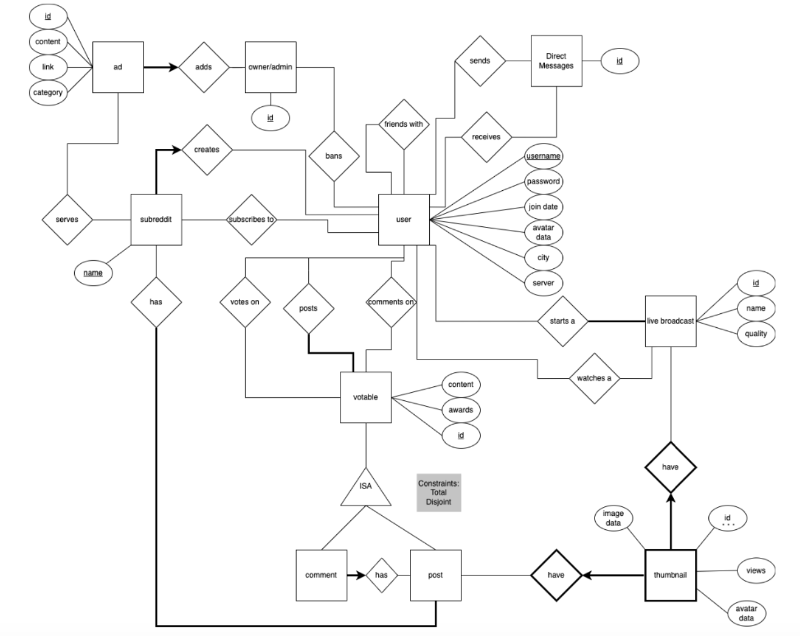
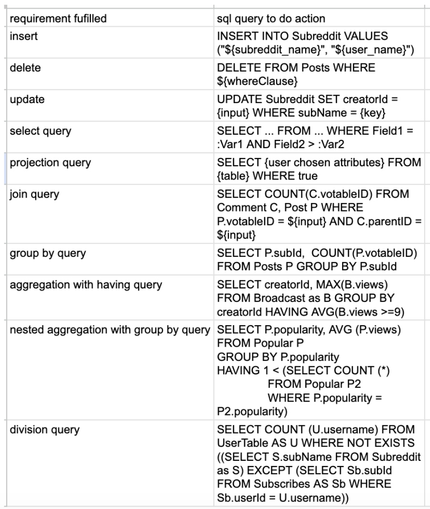
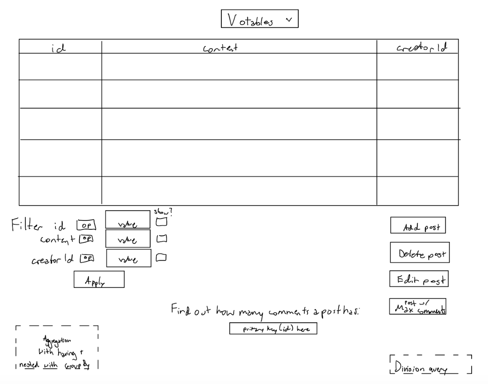

<h1 :class="$style.header">Social Media Admin Interface</h1>

Project Summary
 - 

One other teammate and I created a database schema based on a Reddit-inspired social media site. It has users, subreddits, comments, live broadcasts, ads, messages, admins, thumbnails and posts. The frontend is an admin dashboard made with React.js to accomplish administration features + searches that might not be available to an ordinary user. We used MySQL to interact with and initialize the relational database, and Express to route the REST API requests from the frontend.

<a href="https://github.com/logank8/304-database-project">GitHub repository</a>

Skills showcased
-

<li>Relational database querying</li> 

<li>REST API request routing</li>

<li>Database schema design</li>

<li>UI design and user story development</li>

Highlights
-

<h4>REST API Request Routing With Express</h4>

I configured multiple different user options for database interaction involving different REST API requests that sent different SQL queries to edit, create, and pull database entries.

I also utilized Postman to test our API throughout the process.

<h4>ER Diagram Creation</h4>

After planning user stories and goals for our application, we collaborated to create an entity relationship diagram for the initial layout of the relational database. 

<h4>Converting Queries From Relational Algebra To SQL</h4>

We made a list of relational algebra operations that we wanted our frontend to include. I then converted the relational algebra to different SQL queries.

<h4>Frontend UI Planning</h4>

I collaborated with my partner to plan out our frontend where users could carry out each SQL query.

Our initial visualization:

