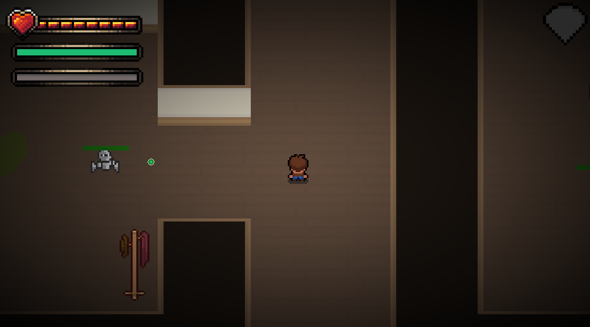
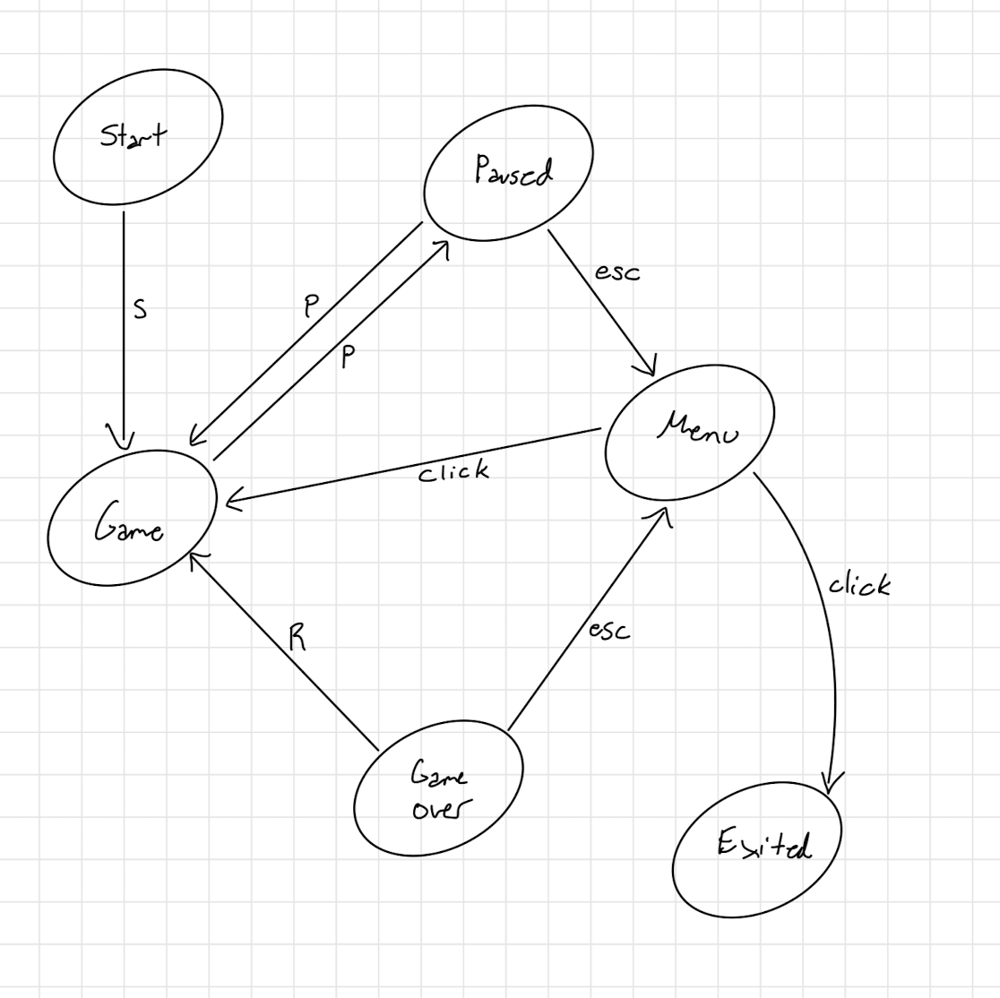

<h1 :class="$style.header">Eviction of the Damned: 2D Video Game</h1>

<h2>Project Summary</h2>

I worked with a team of 4 other developers over 4 months to create a 2D dungeon crawler video game in C++ and OpenGL with an ECS structure. In addition to playing a large role in the project management and debugging, I was responsible for the graphics programming, scene management, BOIDS algorithm implementation for the swarm enemy, tilemap implementation, 2d asset uploads and audio.

<h2>Highlights</h2>

<h4 :class="$style.highlighthead">Particle system</h4>

I added a smoke effect using a particle system that went created an emitter after an enemy dies.

<figure>
  <video controls loop width="500" autoplay muted :class="$style.media">
    <source src="./media/eviction_game/particles.mp4" type="video/mp4">
  </video>
  <figcaption :class="$style.figcaption">In-game examples of the smoke particle effect.</figcaption>
</figure>

To add this into an ECS, I kept each particle as simple structs stored in the ParticleEmitter component of the Smoke entity created. I mainly used <a href="https://www.lri.fr/perso/~mbl/ENS/IG2/devoir2/files/docs/particles.pdf">this article</a> by Jeff Lander to guide me, especially on adding things like variance and randomness in direction. 

In Lander's article the pools of particles are implemented using a linked list, which I believe would be possible to implement within our ECS, so I may look into this as a way to reduce unnecessarily redundant storage on large amounts of particles.

<h4 :class="$style.highlighthead">Lighting model</h4>

I implemented a Phong lighting model into the game using OpenGL and created all functions that darkened and lightened the screen through the shader. 

<figure> 
  
  <figcaption :class="$style.figcaption">Full image of the local illumination model.</figcaption>
</figure>

<figure>
  <video controls loop width="350" autoplay muted :class="$style.media">
    <source src="./media/eviction_game/death.mp4" type="video/mp4">
  </video>
  <figcaption :class="$style.figcaption">When the player dies, the screen slowly darkens and then moves to the Game Over menu screen.</figcaption>
</figure>

<figure>
  <video controls loop width="350" autoplay muted :class="$style.media">
    <source src="./media/eviction_game/light_flicker.mp4" type="video/mp4">
  </video>
  <figcaption :class="$style.figcaption">The light flickers randomly throughout the game to add an unsettling energy to the game visuals.</figcaption>
</figure>

This included a slow darken when the player dies, as well as a randomly occurring light flicker effect to add ambience.

<h4 :class="$style.highlighthead">Boids swarm simulation</h4>

I used a boids flocking algorithm to create a swarm enemy that chased the player and could be individually killed.

<figure>
  <video controls loop width="400" autoplay muted :class="$style.media">
    <source src="./media/eviction_game/boids.mp4" type="video/mp4">
  </video>
  <figcaption :class="$style.figcaption">Fighting and being chased by multiple swarms (other components were disabled during this demonstration).</figcaption>
</figure>

<h4 :class="$style.highlighthead">Scene management</h4>

I handled all transitions between splash screens, menus, cutscenes, and gameplay. I also designed the main menu "elevator" display, which allows the player to access any levels that they have "unlocked" by playing previously.

<figure>
  <video controls loop width="400" autoplay muted :class="$style.media">
    <source src="./media/eviction_game/elevator.mp4" type="video/mp4">
  </video>
  <figcaption :class="$style.figcaption">Elevator main menu when only the first level is unlocked.</figcaption>
</figure>

<figure> 
  
  <figcaption :class="$style.figcaption">My layout of the state transitions for the game.</figcaption>
</figure>

<h4 :class="$style.highlighthead">2D Physics system</h4>

The physics system was a collaborative effort across the entire team. However, I am most proud of my work on the AABB collisions and radius-based proximity detection for interactable objects such as health buffs, NPCs, and doors.

