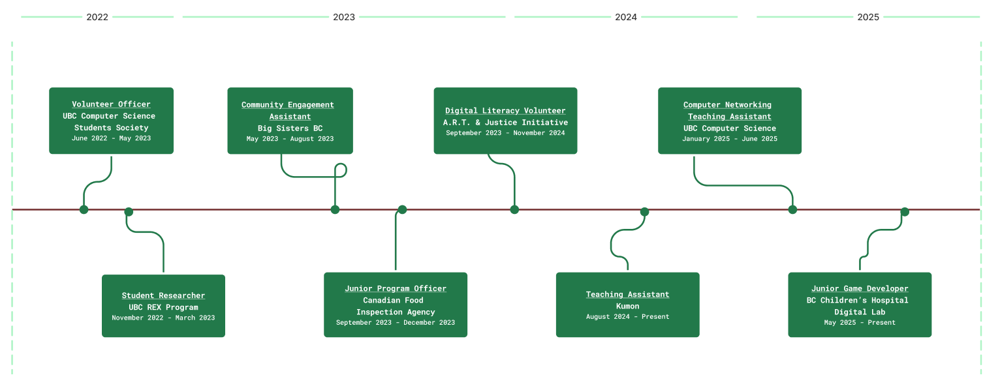

---
# https://vitepress.dev/reference/default-theme-home-page
layout: home
hero:
  name: "Logan Keener"
  text: "Software Engineer"
  tagline: "Open to work in software development, graphics programming, & more."
  image: '.'
  actions:
    - theme: brand
      text: About me
      link: /about
---
<h1>Projects</h1>

  <a href="./unity-particles" :class="$style.card">
      

      Unity Particle Systems & Lighting
      

    </a>
    <a href="./eviction-game" :class="$style.card">
      

      2D Video Game in C++ and OpenGL
      

    </a>
    <a href="./304-project" :class="$style.card">
      

      Social Media Admin Interface
      

      <!--<a href="/304-project" :class="$style.cardText">See More</a>-->
    </a>

 

<h1>Work Experience</h1>

Roles (most recent to least recent):

<li>Junior Game Developer - BC Childrens Hospital Digital Lab</li>
<li>Teaching Assistant - UBC CPSC 317 (Introduction to Computer Networking)</li>
<li>Teaching Assistant - Kumon</li>
<li>Digital Literacy Volunteer - A.R.T. & Justice Initiative</li>
<li>Junior Program Officer - Canadian Food Inspection Agency</li>
<li>Community Engagement Assistant - Big Sisters BC Lower Mainland</li>
<li>Student Researcher - UBC Undergraduate Research Experience Program</li>

