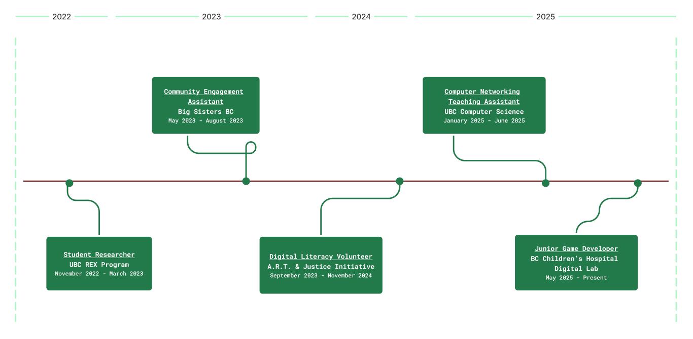

---
# https://vitepress.dev/reference/default-theme-home-page
layout: home
hero:
  name: "Logan Keener"
  text: "Software Engineer"
  tagline: "Open to work in game development & more."
  image: '.'
  actions:
    - theme: brand
      text: About me
      link: /about
---
<h1>Projects</h1>

<a href="./unity-particles" :class="$style.card">
      

        Factory Frenzy
      

      

        <figure>
        </figure>
        

          

            Mar. - May 2026
          

          

            Unity, C#
          

          

            <li>Debugged input handling</li>
            <li>Designed gameplay loop and difficulty progression</li>
            <li>Smooth level transitions</li>
            <li>Designed UI and pause menu</li>
            <li>Audio system</li>
            <li>Built and deployed for user testing</li>
            <li>Interactive tutorial screen</li>
            <li>Designing additional environmental features</li>
          

        

      

    </a>
  <a href="./unity-particles" :class="$style.card">
      

        Virtual Map
      

      

        <figure></figure>
        

          

            Nov. 2025 - Feb. 2026
          

          

            Unity, C#, React.js (typescript?), CSS, SQL
          

          

            <li>Map & goal-setting system</li>
            <li>QA and general debugging</li>
            <li>Designed and developed an admin website to handle user play experiences </li>
            <li>Designed new database</li>
            <li>UI for accessibility</li>
            <li>Reviewed and revised 150+ pages of documentation</li>
          

        

      

    </a>
    <a href="./eviction-game" :class="$style.card">
      

        HeartQuest
      

      

        <figure></figure>
        

          

            May - Sept. 2025
          

          

            Unity, C#, (website code stuff)
          

          

            <li>Debugged input handling & movement</li>
            <li>Fixed player animation errors</li>
            <li>Redesigned dialogue system</li>
            <li>Added interaction to environment</li>
            <li>Quest system</li>
            <li>NPC movement</li>
            <li>Tutorial level design</li>
            <li>Minigames related to different parts of the heart</li>
            <li>Smoothing camera movement in gameplay + cutscenes</li>
            <li>Building & deploying for user testing</li>
            <li>Audio system for ui and environmental sound design</li>
            <li>Redesigned admin portal backend and frontend for play session analytics</li>
          

        

      

    </a>
    <a href="./304-project" :class="$style.card">
      

      Eviction of the Damned
      

      

        <figure></figure>
        

          

            Sept. - Dec. 2024
          

          

            C++, OpenGL
          

          

            Github link: https://github.com/logank8/2d-video-game
            <li>Designed and developed a 2D dungeon crawler game with 4 other developers using an Entity-Component System in C++.</li>
            <li>Wrote 2D shaders in OpenGL.</li>
            <li>Added Boids swarm simulation</li>
            <li>Scene management</li>
            <li>Fine-tuned collision detection for obstacles and interactable objects.</li>
          

        

      

    </a>

 

<h1>Work Experience</h1>

Roles (most recent to least recent):

<li>Game Developer - BC Childrens Hospital Digital Lab</li>
<li>Teaching Assistant - UBC CPSC 317 (Introduction to Computer Networking)</li>
<li>Digital Literacy Volunteer - A.R.T. & Justice Initiative</li>
<li>Community Engagement Assistant - Big Sisters BC Lower Mainland</li>
<li>Student Researcher - UBC Undergraduate Research Experience Program</li>

