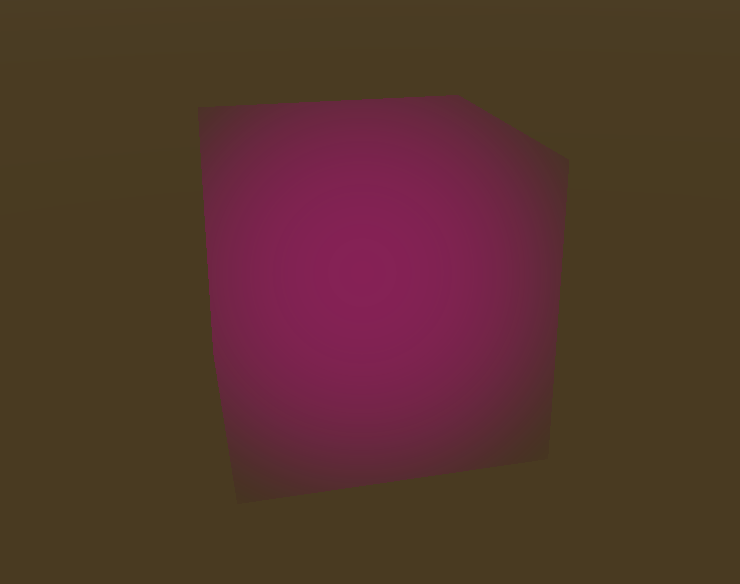

<h1 :class="$style.header">Unity Particle System Lighting</h1>

Project Summary
-

<h5>NOTE</h5>
This project is currently <b>in progress</b>, but this page provides a summary of my plan + my work so far.

I am creating interactive light particle effects in Unity mobile. The user will be able to move trails of lights around the screen and activate firework effects by moving their finger very fast and letting go or pressing down very hard and letting go.

Skills showcased
-

<li>Unity development</li>

<li>Real-time lighting techniques</li>

<li>Unity touch input</li>

Progress
-

Currently I am working on adjusting the light integrated with the touch input. This is what it looks like currently: 

I want to vary this first effect much more - how do we make lights look "ethereal" and "alive"? We need to vary the size, movement patterns, visual effects etc. and make all of these parameters vary in part responding to user input. In order to acheive this, I have multiple tasks planned:

<li>Add custom lighting effects to the particles to make them "glow" - so their light emission is not just reflected in the walls around but also in the particles themselves (Obviously, the wall lighting needs to be tweaked as well).</li>

<li>Reduce the number of particles and instead vary the size.</li>

<li>Implement more responsiveness in the touch functionalities to make it feel more like the user is in control of the light.</li>

<!---

-->
